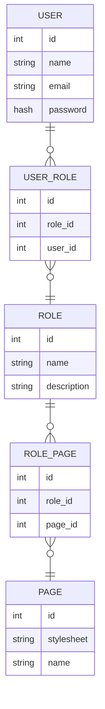

# Simple-PHP-Project

Here you can find all necessary files to start a new PHP application suitable for simple
Web applications.

For simplicity the UI is based on W3.CSS stylesheet.

## Requirements

1. PHP 7.4.x
2. MySQL DB engine
3. Composer from https://getcomposer.org/ (or you can use the provided version)

## Installation

1. Clone this repository with: `git clone <REPO_URL> [TARGET_DIR]`
2. Enter the folder
3. Install composer: `composer install`
4. Create autoload config: `composer dumpautoload`
5. Import DB schema and sample data: `mysql -p -u root < db/dump.sql`
6. Copy DB config example: `cp config/db_example.php config/db.php`
7. Change the `config/db.php` parameters if you need to use another user|db|password

## Testing

Testing is not completed yet but you can enhance the whole application by adding
new test cases to the `tests` directory.

- `composer require --dev phpunit/phpunit ^7`
- To run the tests: `./vendor/bin/phpunit tests`

## Namespaces

To change the name of the namespaces:

1. Edit the `autoload` section in `composer.json` according your used namespaces and directories
2. Update composer: `composer dumpautoload`

## Running

The command below is suitable for local development only.

```bash
php -S localhost:8080 -t web/
```

## Usage

- Go to: https://localhost:8080
- login with `admin@email.com` or `user@email.com` or `guest@email.com` (password is: admin|user|guest+Uppercase(Reverse(admin|user|guest)))
- You can see a random page according to the used account's associated role upon every new login

## Internals

### Entity relations



### Used tools

- MySQL Workbench
- VS Code
- Internal PHP server
- Mermaid
